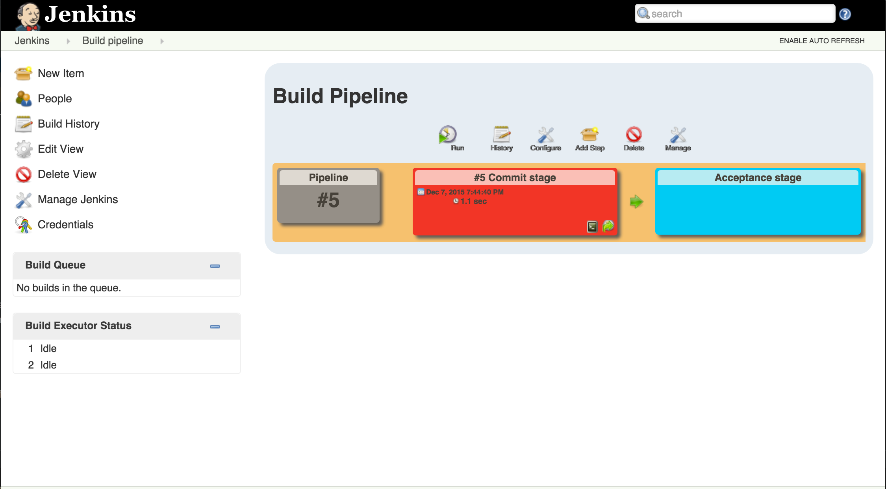

### Day 8

Assignment of today is to extend the test written yesterday to cover a game played
to a draw. This test should now read something like this (but not _exactly_ like 
this):

``` 
   it('Should play game until won or drawn', function (done) {
     given(user("YourUser").createsGame("GameIdOne").named("TheFirstGame"))
       .and(user("OtherUser").joinsGame("GameIdOne"))
       .and(user("YourUser").placesMove(0,0))
       .and(user("OtherUser").placesMove(1,1))
       .andSomeMoreMovesThatLeadToVictory
     .expect("GameDraw").byUser("OtherUser").isOk(done);
   });
``` 

Also, add the Build Pipeline view plugin to Jenkins. When that is done, you should have something
that looks like the image below.



The Acceptance Stage should run deployment to your test server and API acceptance tests
against that server. It must fail (show as red) if either fails.

- Hint: Use "Build after other projects are built" to get build items to chain like this.

